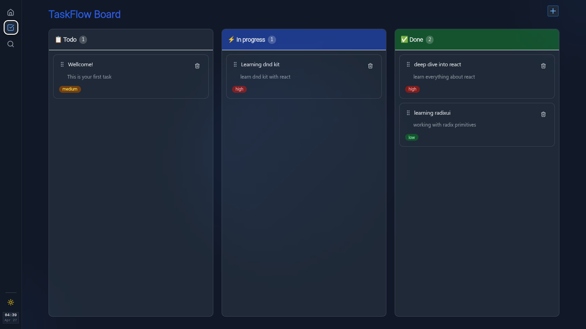

# React Kanban Board

A high-performance Kanban board built with React and TypeScript, featuring a custom client-side router, drag-and-drop functionality, and a responsive, accessible UI.



| | |
|:-----------------------------------:|:-----------------------------------:|
|  |  |


## Features

- **Drag-and-Drop:** Seamlessly move tasks between "To Do", "In Progress", and "Done" columns using `@dnd-kit`.
- **Custom Client-Side Router:** Built entirely from scratch with a custom history stack and nested layout support.
- **Zustand State Management:** Fast, scalable state management with a clean separation of concerns.
- **Modern UI/UX:** Crafted with Tailwind CSS and Radix UI primitives for a polished, accessible design.
- **Dark and Light Mode:** Full theme support with smooth transitions.
- **Fully Responsive:** Works across desktop, tablet, and mobile viewports.
- **Live Search:** Floating command-palette-style search for quick task discovery.
- **Instant Task Creation:** Floating action button for rapid task addition.
- **Priority Badges:** Visual indicators for Low, Medium, and High priority tasks.

## Tech Stack

- **Framework:** React 18 with TypeScript
- **Build Tool:** Vite
- **Styling:** Tailwind CSS, Radix UI
- **State Management:** Zustand
- **Drag-and-Drop:** `@dnd-kit/core` and `@dnd-kit/sortable`
- **Testing:** Vitest, React Testing Library
- **Architecture:** Custom Router, Separation of Concerns, Provider Pattern


## Project Structure

```
src/
├── components/         # Reusable UI and Kanban components
│   ├── board/          # KanbanBoard, Column, TaskCard, TaskDialog
│   │   └── __test__/   # Component tests
│   └── ui/             # Button, Card, Badge
├── providers/          # AppProvider (theme, clock)
├── router/             # Custom client-side router
├── stores/             # Zustand stores (tasks, ui)
├── test/               # Test setup and utilities
├── lib/                # Utility functions
└── App.tsx
```

## Testing

This project uses Vitest as the test runner paired with React Testing Library for component testing. The testing infrastructure is designed to validate component behavior, store logic, and user interactions across the application.

### Test Stack

- **Vitest:** Fast, Vite-native test runner with ESM support
- **React Testing Library:** Component testing with a focus on user behavior
- **jsdom:** Browser environment simulation for Node.js
- **@vitest/coverage-v8:** Code coverage reporting via V8

### Running Tests

```bash
# Run tests in watch mode
pnpm test

# Run tests once
pnpm test:run

# Run tests with coverage report
pnpm test:coverage

# Open Vitest UI (experimental)
pnpm test:ui
```

### Current Coverage

Testing is an ongoing effort. The initial suite covers:

- Component rendering and mounting
- Dependency mocking patterns (Zustand stores, providers, child components)
- DOM assertions and query strategies

Planned test coverage includes:

- User interaction flows (drag-and-drop, form submissions)
- Store state transitions and side effects
- Custom router navigation and history behavior
- Accessibility compliance checks
- Responsive layout breakpoints
- Dark and light mode persistence

### Test Philosophy

Tests are structured following these principles:

- **Behavior over implementation:** Tests assert what the user sees and interacts with, not internal component state.
- **Isolation:** Child components and external stores are mocked to focus tests on the unit under examination.
- **Realistic scenarios:** Test cases mirror actual user workflows rather than artificial edge cases.

## Getting Started

### Prerequisites

- Node.js (v18 or later)
- pnpm (recommended) or npm

### Installation

1. Clone the repository:
   ```bash
   git clone https://github.com/Mehrdadnka/react-kanban.git
   cd react-kanban
   ```

2. Install dependencies:
   ```bash
   pnpm install
   ```

3. Start the development server:
   ```bash
   pnpm dev
   ```

4. Open [http://localhost:5173](http://localhost:5173) in your browser.

### Building for Production

```bash
pnpm build
```

The output will be available in the `dist/` directory.

## What I Learned and Challenges

This project served as a deep exploration of React internals and modern front-end architecture:

- **Custom Router:** Implemented `pushState`, `popState`, and a `navigate` function from scratch to understand client-side routing mechanics.
- **Advanced Drag-and-Drop:** Managed complex DnD state with `@dnd-kit`, including drag overlays and cross-column movement.
- **Architecture Patterns:** Applied Separation of Concerns and the Provider pattern for maintainable, testable code.
- **UI Primitives:** Leveraged Radix UI for unstyled, accessible components, custom-styled with Tailwind.
- **Test Infrastructure:** Configured Vitest with jsdom, mock strategies for third-party libraries, and setup patterns for component testing at scale.

## Contributing

This is a personal showcase project. If you have ideas for improvements or discover a bug, feel free to open an issue.

## Contact

- **GitHub:** [@Mehrdadnka](https://github.com/Mehrdadnka)
- **Email:** [mehrdad2762@gmail.com]