# 🚧 WIP (Work In Progress)

> **This project is currently under active development.**
> Features, documentation, and structure may change frequently.
> Feel free to explore, but expect breaking changes and incomplete parts.

---

# React Kanban Board

A sophisticated, high-performance Kanban board crafted with React 18 and TypeScript. Features a custom client-side router, fluid drag-and-drop interactions, an interactive dashboard with contextual sidebar drill-downs, and an exquisitely polished responsive UI.


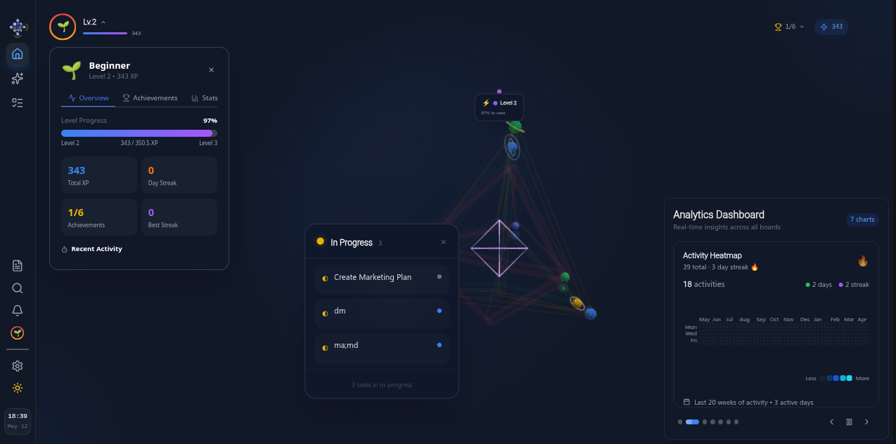
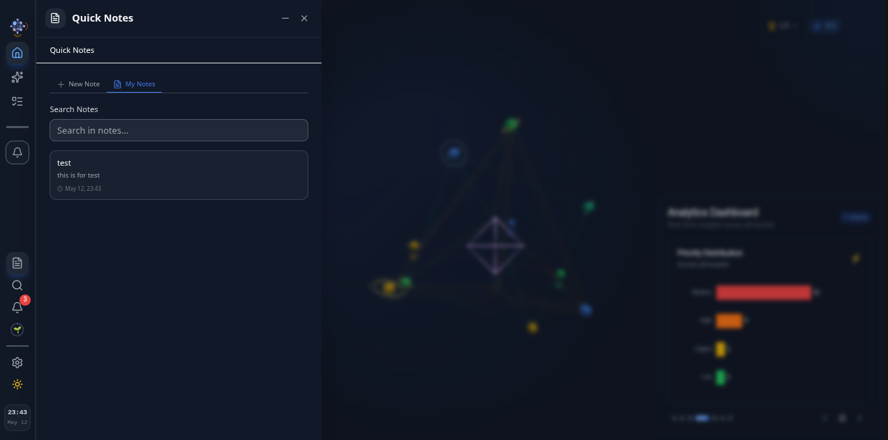
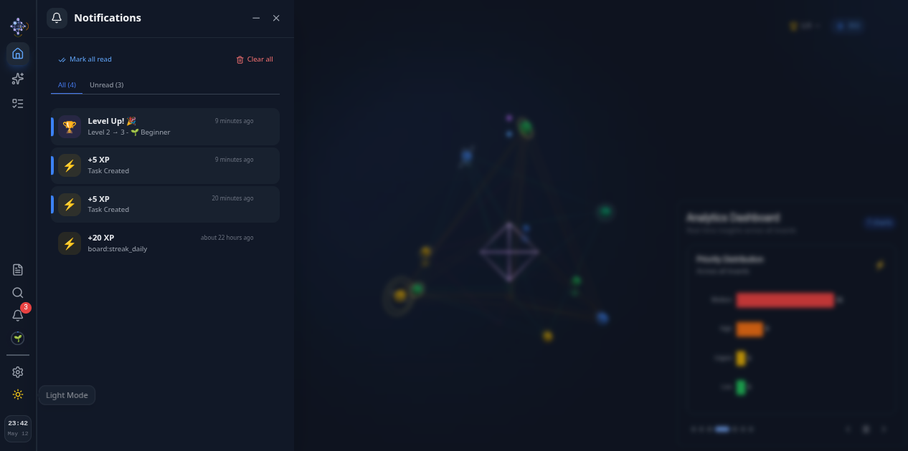
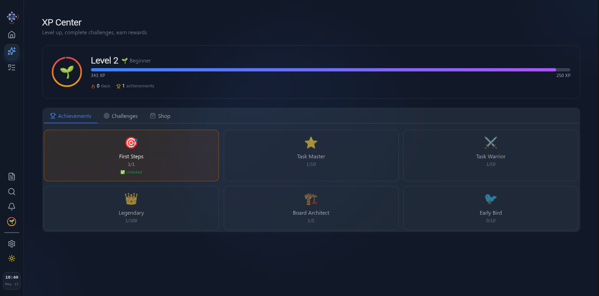
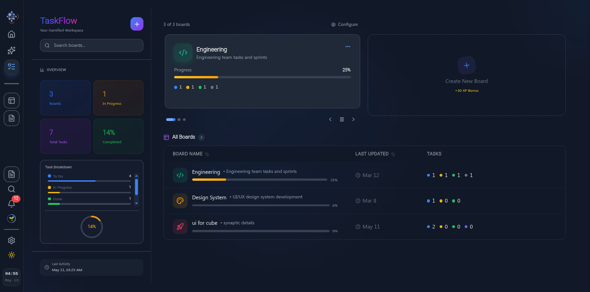
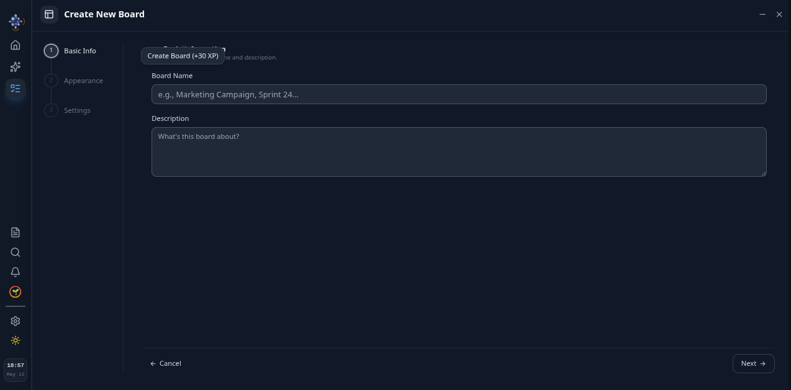
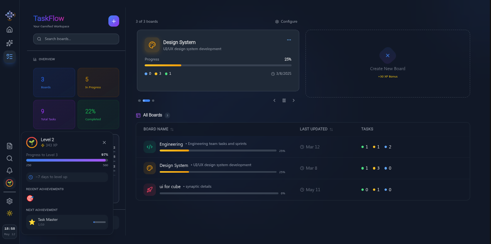
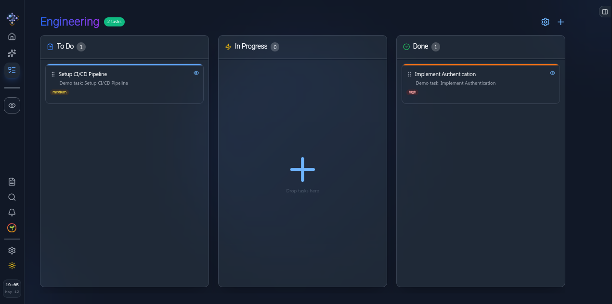
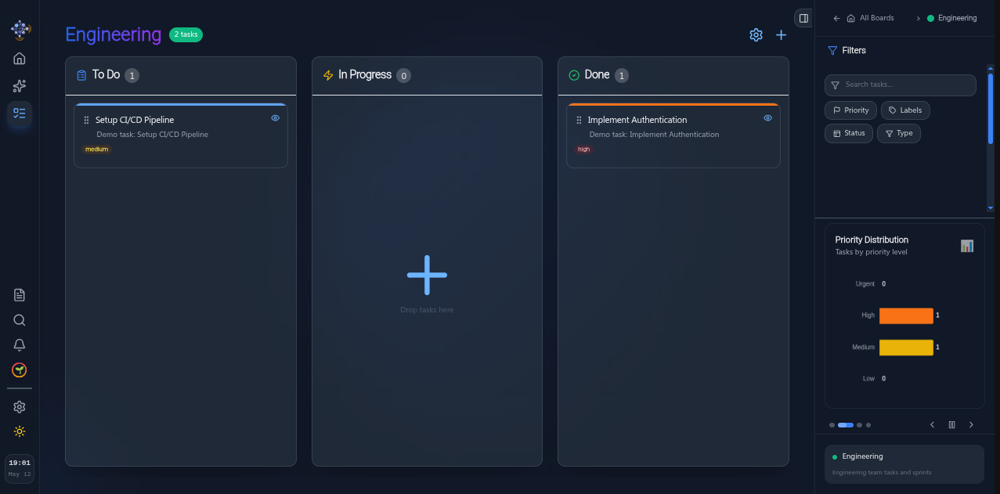
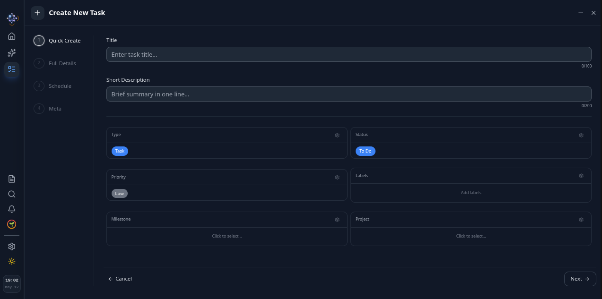
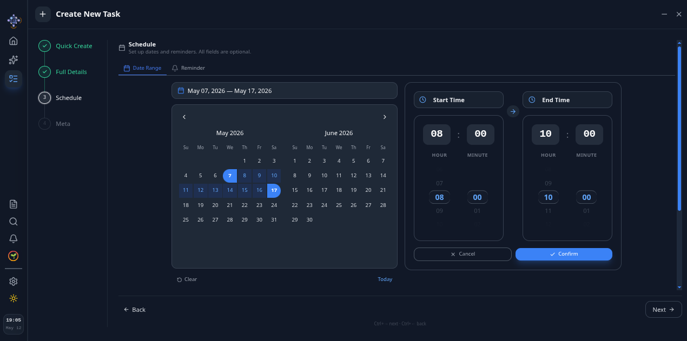
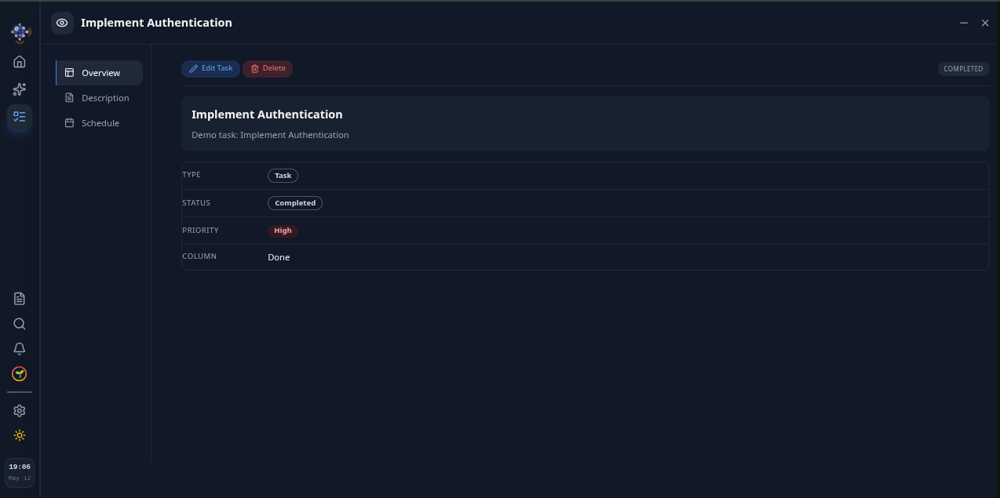

## Features

- **Kanban Board:** Drag-and-drop tasks across "To Do", "In Progress", and "Done" columns with smooth animations
- **Interactive Dashboard:** Task overview widgets with contextual drill-down sidebar for filtered, focused views
- **Activity Heatmap:** 365-day GitHub-style contribution graph with dedicated canvas rendering engine and intelligent tooltips
- **Sidebar Orchestration Engine:** Centralized floating panel lifecycle management with z-index stacking, overlay coordination, and priority-based minimize/restore
- **Atomic Sidebar Architecture:** Main sidebar decomposed into composable feature modules with render-prop pattern for variant-aware rendering
- **Responsive Sidebar System:** Desktop fixed icon sidebar with tooltips, mobile hamburger-triggered drawer with full-width labeled items
- **Panel Minimize/Restore:** Windows-like minimize to sidebar with complete state preservation across minimize/restore cycles
- **Position Strategy:** Panels support left/right/overlay positioning with responsive-aware margin synchronization
- **Unified Action Buttons:** Responsive PanelActions composer — separate ghost buttons on desktop, unified pill container on mobile with divider
- **Dynamic Panel Icons:** Context-aware icons reflecting panel mode (create/view/edit) and active dashboard widget
- **Centralized Icon Registry:** Single source of truth for all icons across panels, widgets, navigation, and board columns
- **Route-Persistent Search:** Search panel survives route transitions while other panels gracefully close
- **Multi-Panel Minimize:** Multiple panels minimized simultaneously with context-aware sidebar indicators
- **Quick Actions:** Floating action button for instantaneous task creation
- **Live Search:** Command-palette-style search with keyboard shortcut (⌘K / Ctrl+K)
- **Dark/Light Mode:** Comprehensive theme support with system preference detection and persistent storage
- **Fully Responsive:** Meticulously optimized for desktop, tablet, and mobile form factors
- **Priority System:** Visual badges with color-coded indicators for Low, Medium, and High priority levels
- **Persistent Storage:** Tasks automatically persisted to localStorage
- **Accessible:** Built on Radix UI primitives following WAI-ARIA accessibility standards

---

## Sidebar Orchestration Engine

The engine is an **event-driven orchestration layer** that centralizes floating panel lifecycle management. Instead of each panel independently managing its own overlay, z-index, and transitions, the engine functions as a **single source of truth** for all panel behavior.

### Architecture

```
┌─────────────────────────────────────────┐
│              SidebarProvider            │
│  ┌───────────────────────────────────┐  │
│  │        PanelRenderer              │  │
│  │  ┌──────────┐  ┌──────────────┐   │  │
│  │  │ Unified  │  │ Panel Stack  │   │  │
│  │  │ Overlay  │  │ (LIFO)       │   │  │
│  │  │ Position │  │              │   │  │
│  │  │ -Aware   │  │              │   │  │
│  │  └──────────┘  └──────────────┘   │  │
│  └───────────────────────────────────┘  │
│                    │                    │
│         ┌──────────▼──────────┐         │
│         │  SidebarEngineStore │         │
│         │  (Zustand)          │         │
│         │  - panels registry  │         │
│         │  - stack (LIFO)     │         │
│         │  - register/open/   │         │
│         │    close/minimize/  │         │
│         │    closeAllExcept   │         │
│         └─────────────────────┘         │
└─────────────────────────────────────────┘
```

### Core Concepts

**Panel Registration:** Panels self-register via the `useSidebarPanel` hook, declaring their identity, component, priority tier, and spatial position.

```typescript
useSidebarPanel({
  id: 'task-sidebar',
  component: TaskSidebar,     // Must implement PanelProps
  priority: 10,               // Higher = on top, minimizes lower panels
  position: 'left',           // 'left' | 'right' | 'overlay'
});
```

**Priority Stacking:** When a higher-priority panel opens, lower-priority visible panels automatically minimize. Already-minimized panels remain in their minimized state.

**Minimize/Restore:** Panels feature a minimize button that preserves DOM state. Minimized panels manifest as icons in the main sidebar for immediate restoration. Search icon toggles minimize/restore analogous to a Windows taskbar behavior.

**Overlay Coordination:** A single unified overlay renders behind the active panel. Position-aware: `ml-16` offset for side panels, full-screen dark backdrop for overlay panels (search). Clicking the overlay triggers `closeTop()`.

**Route Awareness:** Route changes invoke `closeAllExcept('search-sidebar')`, closing all panels except search which persists across navigation.

**State Preservation:** Minimized panels retain their DOM and internal state. Form data, search queries, and widget selections survive minimize/restore cycles intact.

### Adding a New Panel

```typescript
// 1. Create component implementing PanelProps
const MyPanel: React.FC<PanelProps> = ({ isOpen, onClose, isDarkMode }) => (
  <div className={`fixed right-0 transition-transform duration-300 
    ${isOpen ? 'translate-x-0' : 'translate-x-full'}`}>
    <button onClick={onClose}>Close</button>
  </div>
);

// 2. Register it
useSidebarPanel({
  id: 'my-panel',
  component: MyPanel,
  priority: 7,
});

// 3. Open from anywhere
useSidebarEngineStore.getState().open('my-panel', { metadata: 'here' });
```

---

## Atomic Sidebar Architecture (Main Sidebar)

The main application sidebar underwent a comprehensive architectural decomposition from a 200-line monolithic component into a suite of composable, single-responsibility modules.

### Architecture

```
┌──────────────────────────────────────────────┐
│  components/layout/Sidebar.tsx (composition) │
│  ┌────────────────────────────────────────┐  │
│  │         SidebarProvider                │  │
│  │  ┌──────────────────────────────────┐  │  │
│  │  │     SidebarContainer             │  │  │
│  │  │  (render-prop: variant)          │  │  │
│  │  │  ┌──────────┐ ┌──────────────┐   │  │  │
│  │  │  │ Desktop  │ │ Mobile       │   │  │  │
│  │  │  │ Fixed    │ │ Drawer       │   │  │  │
│  │  │  │ (w-16)   │ │ (Dialog)     │   │  │  │
│  │  │  └──────────┘ └──────────────┘   │  │  │
│  │  └──────────────────────────────────┘  │  │
│  │                    │                   │  │
│  │     ┌──────────────┼──────────────┐    │  │
│  │     │              │              │    │  │
│  │  ┌──▼──┐ ┌────────▼──┐ ┌──────────▼┐   │  │
│  │  │ Nav │ │ Minimized │ │    Tools  │   │  │
│  │  │ Sec │ │  Section  │ │  Section  │   │  │
│  │  └─────┘ └───────────┘ └───────────┘   │  │
│  │  ┌──────────────────────────────────┐  │  │
│  │  │         SidebarClock             │  │  │
│  │  └──────────────────────────────────┘  │  │
│  └────────────────────────────────────────┘  │
│                                              │
│  features/sidebar/                           │
│  ├── components/                             │
│  │   ├── SidebarProvider.tsx    (context)    │
│  │   ├── SidebarContainer.tsx   (render-prop)│
│  │   ├── SidebarItem.tsx        (atom)       │
│  │   ├── SidebarNavSection.tsx               │
│  │   ├── SidebarMinimizedSection.tsx         │
│  │   ├── SidebarToolsSection.tsx             │
│  │   ├── SidebarClock.tsx                    │
│  │   ├── HamburgerMenu.tsx                   │
│  └── hooks/                                  │
│      ├── useSearchControl.ts                 │
│      └── useMinimizedPanelIcon.ts            │
└──────────────────────────────────────────────┘
```

### Responsive Behavior

| Breakpoint | Sidebar Mode | Item Variant | Interaction |
|------------|-------------|--------------|-------------|
| < 768px | Hidden + Hamburger Drawer | `full` (icon + label) | Dialog overlay, CollapseIcon close |
| ≥ 768px | Fixed left (w-16) | `icon-only` | Tooltips on hover |

**SidebarItem** component supports dual rendering modes:
- **`icon-only`:** Compact 40×40px button with Radix Tooltip for label
- **`full`:** Full-width button with icon + label text, no tooltip needed

### Action Buttons System

All panels share a unified, responsive action button architecture:

| Context | Desktop | Mobile |
|---------|---------|--------|
| Panel header | Separate ghost `MinimizeButton` + `CloseButton` | Unified pill container with divider |
| Mobile drawer | N/A | Solid `CollapseButton` (custom SVG) |

The `PanelActions` composer handles responsive switching automatically, ensuring consistent interaction patterns across all panels.

## Sidebar UI Engine

A **reusable atomic component library** that standardizes all sidebar panel UIs across the application. Built on the principle of "dumb UI, smart stores"—panels become pure logic orchestrators while the engine handles all visual consistency, animations, dark mode, and responsive behavior.

### Architecture

```
┌──────────────────────────────────────────────────────┐
│               Sidebar Panels (Logic)                 │
│  ┌─────────────┐  ┌───────────────────┐              │
│  │ TaskSidebar │  │ DashboardSidebar  │              │
│  │ (form,      │  │ (stats, lists,    │              │
│  │  CRUD)      │  │  navigation)      │              │
│  └──────┬──────┘  └────────┬──────────┘              │
│         │                  │                         │
│         └────────┬─────────┘                         │
│                  ▼                                   │
│  ┌───────────────────────────────────────────────┐   │
│  │            Sidebar UI Engine                  │   │
│  │                                               │   │
│  │  ┌─────────────┐  ┌───────────────────────┐   │   │
│  │  │  Container  │  │    Form Elements      │   │   │
│  │  │  - Shell    │  │    - Input            │   │   │
│  │  │  - Action   │  │    - Textarea         │   │   │
│  │  │    Bar      │  │    - Select           │   │   │
│  │  └─────────────┘  └───────────────────────┘   │   │
│  │                                               │   │
│  │  ┌─────────────┐  ┌───────────────────────┐   │   │
│  │  │   Actions   │  │    Data Display       │   │   │
│  │  │  - Close    │  │    - TaskCard         │   │   │
│  │  │  - Minimize │  │    - StatsCard        │   │   │
│  │  │  - Collapse │  │    - ProgressBar      │   │   │
│  │  │  - Panel    │  │    - PriorityList     │   │   │
│  │  │    Actions  │  │                       │   │   │
│  │  └─────────────┘  └───────────────────────┘   │   │
│  │                                               │   │
│  │  ┌───────────────────────────────────────┐    │   │
│  │  │            Feedback                   │    │   │
│  │  │             - ConfirmDialog           │    │   │
│  │  │             - MetaInfo                │    │   │
│  │  └───────────────────────────────────────┘    │   │
│  └───────────────────────────────────────────────┘   │
└──────────────────────────────────────────────────────┘
```

### Core Components (15 atomic pieces)

| # | Category | Component | Purpose |
|---|----------|-----------|---------|
| 1 | **Container** | `SidebarShell` | Universal wrapper: responsive slide animation, ESC dismissal, position-aware overlay, breadcrumbs, dark/light theme, header with icon + title + action buttons |
| 2 | | `SidebarActionBar` | Footer with `ActionLeft`/`ActionRight` composition groups for button placement |
| 3 | **Form** | `SidebarInput` | Text input with view/edit mode, dark mode styling, auto-focus via ref forwarding |
| 4 | | `SidebarTextarea` | Multi-line input with disabled state transparency, resizable textarea |
| 5 | | `SidebarSelect` | Dropdown with icon-augmented options, theme-aware trigger and content |
| 6 | **Data Display** | `SidebarTaskCard` | Task card in two variants: `compact` (widget lists, status dot + badge) and `detailed` (search results, filtered views, priority + date + description) |
| 7 | | `SidebarStatsCard` | Metric card with icon, value, hover scale effect, and navigation arrow |
| 8 | | `SidebarProgressBar` | Animated gradient progress bar with label, percentage, and optional children slot |
| 9 | | `SidebarPriorityList` | Priority breakdown with icons, counts, percentages, and color-coded progress bars |
| 10 | **Feedback** | `SidebarConfirmDialog` | Two-step delete confirmation with destructive (`red`) and warning (`yellow`) visual variants, icon slot |
| 11 | | `SidebarMetaInfo` | Key-value metadata display for view mode (timestamps, status badges, etc.) |
| 12 | **Actions** | `CloseButton` | Atomic close button (`X` icon), 3 sizes, ghost/solid variants, dark mode |
| 13 | | `MinimizeButton` | Atomic minimize button (`Minus` icon), 3 sizes, ghost style, dark mode |
| 14 | | `CollapseButton` | Atomic collapse button with custom `CollapseIcon` SVG, 3 sizes, ghost/solid variants |
| 15 | | `PanelActions` | Responsive composer: separate ghost buttons on desktop, unified pill container with divider on mobile—automatically adapts to viewport |
| * | *(icon)* | `CollapseIcon` | Custom SVG icon: rounded panel rectangle with vertical divider line and chevron arrow |

### Category Breakdown

```
Container   ██░░░░░░░░  (2)  Shell + ActionBar
Form        ███░░░░░░░  (3)  Input + Textarea + Select
Data        ████░░░░░░  (4)  TaskCard + StatsCard + ProgressBar + PriorityList
Feedback    ██░░░░░░░░  (2)  ConfirmDialog + MetaInfo
Actions     █████░░░░░  (5)  CloseButton + MinimizeButton + CollapseButton + PanelActions + CollapseIcon
            ─────────
            15 atomic pieces
```

### Responsive Action System

The `PanelActions` composer encapsulates all responsive logic for panel control buttons:

| Context | Desktop (≥768px) | Mobile (<768px) |
|---------|------------------|-----------------|
| **Panel header** | Two separate ghost buttons: `MinimizeButton` + `CloseButton` | Single unified pill container with vertical divider: `CollapseIcon` + `CloseButton` |
| **Main sidebar drawer** | N/A (fixed sidebar) | `CollapseButton` (solid variant, larger touch target) |
| **Overlay panels** | Ghost buttons inline | Pill container, matches sidebar hamburger style |

This ensures consistent, platform-native interaction patterns across all device sizes without any conditional logic in panel code.

### Why a Separate UI Engine?

| Concern | Without Engine | With Engine |
|---------|---------------|-------------|
| **Animation & ESC logic** | Each panel duplicates 30+ lines | `SidebarShell` encapsulates once |
| **Dark mode** | Classes scattered across 10+ files | Single `isDarkMode` prop propagation |
| **Spacing & typography** | Inconsistent across panels | Standardized via atomic components |
| **Task card rendering** | 200+ lines duplicated across widgets | One `SidebarTaskCard` with `variant` prop |
| **Action buttons** | Each panel hand-crafts close/minimize | `PanelActions` composer, responsive by default |
| **New panel creation** | Copy-paste 150+ lines of boilerplate | Compose from existing 15 atoms in minutes |
| **Testing** | Test duplication across panels | Test each atom once, compose with confidence |

### Example: Building a New Panel

```tsx
// CalendarSidebar.tsx — assembled in minutes with existing atoms
const CalendarSidebar: React.FC<PanelProps> = ({ isOpen, onClose, isDarkMode }) => (
  <SidebarShell 
    isOpen={isOpen} 
    onClose={onClose} 
    isDarkMode={isDarkMode} 
    panelId="calendar-panel"
    title={event.title} 
    icon={<Calendar />}
    showMinimize
  >
    <SidebarMetaInfo items={[
      { icon: <Clock />, label: 'Date', value: event.date },
      { icon: <MapPin />, label: 'Location', value: event.location },
    ]} />
    <SidebarActionBar>
      <SidebarActionRight>
        <Button>Edit</Button>
      </SidebarActionRight>
    </SidebarActionBar>
  </SidebarShell>
);
```

**Result:** 90% less boilerplate per new panel, 100% consistent UI, zero duplicated animation/theme logic. The panel inherits responsive behavior, dark mode, minimize/restore, ESC dismissal, and overlay coordination automatically.

## Centralized Icon Registry

All icons across the application are governed through a single configuration file (`config/panel-icons.config.ts`), eliminating scattered hardcoded imports and ensuring unwavering visual consistency.

### Icon Categories

| Category | Purpose | Cardinality |
|----------|---------|-------------|
| `PANEL_ICONS` | Sidebar panel headers and minimized indicators | 5 entries |
| `NAV_ICONS` | Main navigation items | 2 entries |
| `WIDGET_ICONS` | Dashboard widget headers and drill-down sidebars | 7 entries |
| `COLUMN_ICONS` | Kanban board columns | 3 entries |

### Dynamic Icon Resolution

Panels dynamically override their default icon based on runtime context:
- **Task Sidebar:** Renders `Plus`/`Eye`/`Edit3` based on mode (create/view/edit)
- **Dashboard Sidebar:** Reflects active widget's icon when drill-down is open
- **Minimized Panels:** Display context-sensitive icon reflecting current state, not just panel type

```typescript
// Adding a new panel with icon registration
export const PANEL_ICONS = {
  'calendar-panel': {
    icon: Calendar,
    label: 'Calendar',
    description: 'Calendar view of tasks',
  },
} as const;
```

---

## Activity Heatmap Engine

The heatmap engine is a **pure rendering layer** decoupled from React's lifecycle. It handles canvas drawing, pixel-precise mouse tracking, retina display scaling, theme-aware color mapping, and tooltip positioning—all through a clean separation between engine logic, Zustand state, and dumb UI components.

### Architecture

```
┌──────────────────────────────────────────────────┐
│                 ActivityHeatmap                  │
│  ┌────────────────────────────────────────────┐  │
│  │         HeatmapRenderer (Pure TS)          │  │
│  │  ┌──────────────┐  ┌──────────────────┐    │  │
│  │  │ Canvas Draw  │  │  Mouse Tracking  │    │  │
│  │  │ - Cells      │  │  - getCanvasPos  │    │  │
│  │  │ - Month/Day  │  │  - Cell hit test │    │  │
│  │  │   Labels     │  │  - Hover clear   │    │  │
│  │  └──────────────┘  └──────────────────┘    │  │
│  │  ┌──────────────┐  ┌──────────────────┐    │  │
│  │  │ Color Engine │  │  Tooltip Pos     │    │  │
│  │  │ - Theme map  │  │  - Viewport edge │    │  │
│  │  │ - Highlight  │  │    detection     │    │  │
│  │  │ - lightenCol │  │  - Arrow dir     │    │  │
│  │  └──────────────┘  └──────────────────┘    │  │
│  └────────────────────────────────────────────┘  │
│                       │                          │
│            ┌──────────▼──────────┐               │
│            │   HeatmapStore      │               │
│            │   (Zustand)         │               │
│            │   - heatmapData     │               │
│            │   - hoveredCell     │               │
│            │   - tooltipData     │               │
│            │   - highlightLevel  │               │
│            │   - calculateData() │               │
│            └─────────────────────┘               │
│                       │                          │
│     ┌─────────────────┼─────────────────┐        │
│     │                 │                 │        │
│  ┌──▼──┐   ┌──────────▼────┐   ┌────────▼───┐    │
│  │Stats│   │Canvas+Tooltip │   │  Legend    │    │
│  │Dumb │   │   Dumb        │   │  Dumb      │    │
│  └─────┘   └───────────────┘   └────────────┘    │
└──────────────────────────────────────────────────┘
```

### Core Concepts

**Data Flow:**
```
Tasks → calculateHeatmapData() → HeatmapStore → Dumb Components
                                                    ↓
                                            HeatmapRenderer
                                         (reads days array,
                                          renders canvas)
```

Canvas mouse events flow back through the renderer's callback → store → Tooltip component—React never touches the canvas internals.

**Framework-Agnostic Renderer:** `HeatmapRenderer` is a pure TypeScript class with zero React dependencies. It owns the `<canvas>` element, handles device pixel ratio scaling for retina displays, and draws 365 days of activity cells with rounded corners, subtle borders, and hover glow effects. All mouse event handling stays inside the renderer, reporting cell interactions through a single callback.

**Zustand State Bridge:** The store acts as the single source of truth between the engine and UI. `calculateData(tasks)` runs pure computations (date mapping, activity levels, streak counting) and stores the result. UI components subscribe to only the slices they need—`HeatmapStats` reads `totalActivity/activeDays/currentStreak`, `HeatmapLegend` reads `highlightLevel`, and `HeatmapTooltip` reads `tooltipData`.

**Smart Tooltip Positioning:** The tooltip calculator detects viewport boundaries and flips the tooltip above/below the cursor automatically. It also constrains horizontal position to prevent overflow, with the arrow always pointing at the hovered cell.

**Performance Optimizations:**
- `React.memo` on all dumb components with shallow prop comparison
- `useMemo` for computed colors and legend items
- Renderer only redraws when options actually change via `setOptions()`
- Canvas event listeners use arrow functions to avoid rebinding

### Why Separate the Engine?

| Concern | Without Engine | With Engine |
|---------|---------------|-------------|
| **Canvas logic** | Mixed in React component (200+ lines) | Isolated `HeatmapRenderer` class |
| **Testing** | Requires full React render | Pure functions, no DOM needed |
| **Reusability** | Tied to one component | Drop into any view with any layout |
| **Debugging** | Hard to isolate canvas vs state bugs | Clear boundaries: engine → store → UI |
| **Performance** | Re-renders trigger redraws | Explicit `setOptions()` control |

---

## Tech Stack


## Project Structure

```
src/
├── assets/                        # Static assets
├── components/
│   ├── sidebar-ui-engine/         # Reusable atomic sidebar UI library
│   │   ├── SidebarShell.tsx       # Universal panel container
│   │   ├── SidebarInput.tsx       # Standardized input field
│   │   ├── SidebarTextarea.tsx    # Standardized textarea field
│   │   ├── SidebarSelect.tsx      # Standardized select dropdown
│   │   ├── SidebarActionBar.tsx   # Action bar with Left/Right groups
│   │   ├── SidebarConfirmDialog.tsx # Destructive/warning confirmation
│   │   ├── SidebarMetaInfo.tsx    # Key-value metadata display
│   │   ├── SidebarTaskCard.tsx    # Compact/detailed task cards
│   │   ├── SidebarStatsCard.tsx   # Metric card with icon & value
│   │   ├── SidebarProgressBar.tsx # Animated progress bar
│   │   ├── SidebarPriorityList.tsx # Priority breakdown list
│   │   ├── CloseButton.tsx        # Atomic close button (X icon)
│   │   ├── MinimizeButton.tsx     # Atomic minimize button (Minus icon)
│   │   ├── CollapseButton.tsx     # Atomic collapse button (custom SVG)
│   │   ├── CollapseIcon.tsx       # Custom SVG collapse icon
│   │   ├── PanelActions.tsx       # Responsive close/minimize composer
│   │   └── index.ts               # Barrel exports
│   ├── board/                     # Kanban board, columns, task cards
│   │   └── __test__/              # Board component tests
│   ├── dashboard/                 # Dashboard with interactive widgets
│   ├── layout/                    # Main layout, sidebar composition
│   └── ui/                        # Reusable UI primitives
├── config/                        # Centralized icon registry
├── hooks/                         # Custom React hooks
├── features/
│   ├── sidebar/                   # Main sidebar feature module
│   │   ├── components/            # Sidebar structure components
│   │   │   ├── SidebarProvider.tsx    # Context + TooltipProvider
│   │   │   ├── SidebarContainer.tsx   # Desktop fixed / mobile drawer
│   │   │   ├── SidebarItem.tsx        # Icon-only / full variants
│   │   │   ├── SidebarNavSection.tsx  # Navigation items
│   │   │   ├── SidebarMinimizedSection.tsx # Minimized panel indicators
│   │   │   ├── SidebarToolsSection.tsx     # Search + theme toggle
│   │   │   ├── SidebarClock.tsx            # Responsive clock display
│   │   │   └── HamburgerMenu.tsx           # Mobile trigger button
│   │   └── hooks/                 # Sidebar-specific logic
│   │       ├── useSearchControl.ts        # Search panel state machine
│   │       └── useMinimizedPanelIcon.ts   # Dynamic minimized icons
│   ├── TaskSidebar/               # Task detail/edit/create panel
│   ├── DashboardSidebar/          # Dashboard drill-down panel
│   └── widgets/                   # Dashboard widgets
│       └── activity-heatmap/      # Heatmap feature module
│           ├── engine/            # Pure calculations & canvas renderer
│           ├── store/             # Zustand state bridge
│           ├── components/        # Dumb UI components
│           ├── constants.ts       # Shared constants
│           └── types.ts           # Shared types
├── lib/                           # Utility functions (cn helper)
├── types/                         # Shared TypeScript types
├── providers/                     # App, Theme, Sidebar providers
├── router/                        # Custom client-side router
│   └── Pages/                     # Route page components
├── stores/                        # Zustand state management
│   ├── sidebar-engine/            # Engine core (types, store)
│   ├── task.store.ts              # Task CRUD operations
│   ├── task-sidebar.store.ts      # Task panel state machine
│   ├── search-sidebar.store.ts    # Search panel state
│   └── dashboard-sidebar.store.ts # Dashboard panel state
└── test/                          # Test setup and configuration
```

## Getting Started

### Prerequisites

- **Node.js** v18 or later
- **pnpm** (recommended) or npm

### Installation

```bash
# Clone the repository
git clone https://github.com/Mehrdadnka/react-kanban.git
cd react-kanban

# Install dependencies
pnpm install

# Start development server
pnpm dev
```

Open [http://localhost:5173](http://localhost:5173) in your browser.

### Production Build

```bash
pnpm build
```

Output will be in the `dist/` directory.

## Testing

This project uses **Vitest** with **React Testing Library** for comprehensive component and store testing.

### Quick Commands

```bash
pnpm test          # Watch mode
pnpm test:run      # Run once
pnpm test:coverage # With coverage report
pnpm test:ui       # Vitest UI dashboard
```

### Testing Philosophy

- **Behavior over implementation:** Tests assert user-facing behavior, not internal state
- **Isolation:** Components tested independently with mocked dependencies
- **Realistic scenarios:** Test cases mirror actual user workflows

## Key Learnings

This project was a deep dive into React internals and modern front-end architecture:

- **Sidebar Orchestration Engine:** Designed an event-driven panel management system with z-index stacking, priority-based minimize/restore, LIFO closing, and route-aware cleanup. Replaced Framer Motion with optimized CSS transitions for a 40%+ performance improvement.
- **Atomic Sidebar Decomposition:** Refactored a 200-line monolithic sidebar into 12 composable feature modules using render-prop pattern for variant-aware rendering across responsive breakpoints.
- **Responsive Action System:** Crafted a unified button architecture with `PanelActions` composer that renders separate ghost buttons on desktop and a unified pill container with separator on mobile—matching native platform conventions.
- **State Preservation Strategy:** Kept DOM mounted during minimize with CSS `translate-x-full` + `pointer-events: none` instead of unmounting, preserving form state and scroll position.
- **Icon Registry Pattern:** Centralized icon management reducing 40+ hardcoded imports to a single config file, enabling one-click icon changes across the entire application.
- **Position-Aware Overlay:** Overlay respects panel position—side panels get `ml-16` offset while overlay panels (search) get full-screen dark backdrop, with responsive margin synchronization.
- **Canvas Engine Architecture:** Separated a pure TypeScript renderer from React's lifecycle, handling retina scaling, pixel-precise mouse hit testing, and theme-aware color mapping. Bridged to React via Zustand for minimal re-renders.
- **Custom Router:** Built `pushState`, `popState`, and navigation from scratch to understand client-side routing.
- **Drag & Drop:** Implemented complex DnD with `@dnd-kit`, including drag overlays and cross-column movement.
- **State Management:** Designed Zustand stores with clean separation of concerns—engine state vs panel-specific state vs domain state.
- **Component Architecture:** Applied provider pattern, compound components, render-props, and strict separation of concerns.
- **Performance Optimization:** Replaced Framer Motion with CSS transitions, added `React.memo`, shallow comparison selectors, and DOM removal for hidden panels.
- **UI Primitives:** Leveraged Radix UI for accessible, unstyled components with Tailwind customization.
- **Type Safety:** Achieved strict TypeScript with Record types, discriminated unions, and type narrowing.
- **Testing Infrastructure:** Configured Vitest with jsdom, mock strategies, and reusable test utilities.

## Contributing

This is a personal showcase project. If you have ideas for improvements or discover a bug, feel free to open an issue or submit a pull request.

## Contact

- **GitHub:** [@Mehrdadnka](https://github.com/Mehrdadnka)
- **Email:** mehrdad2762@gmail.com
