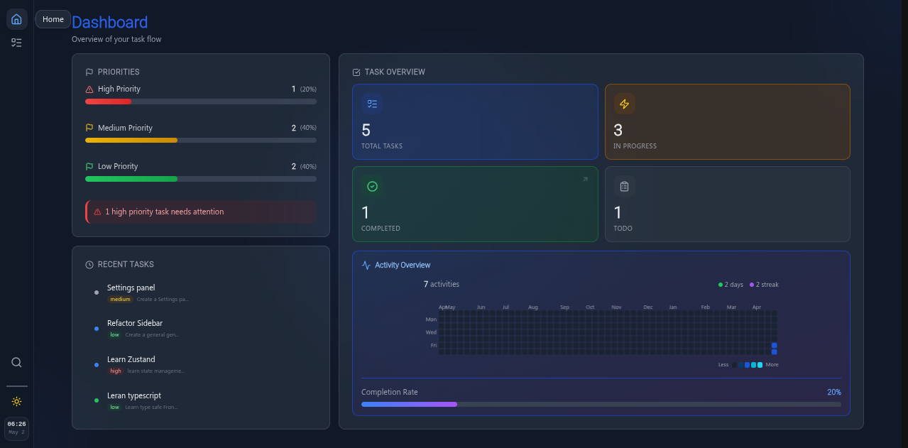
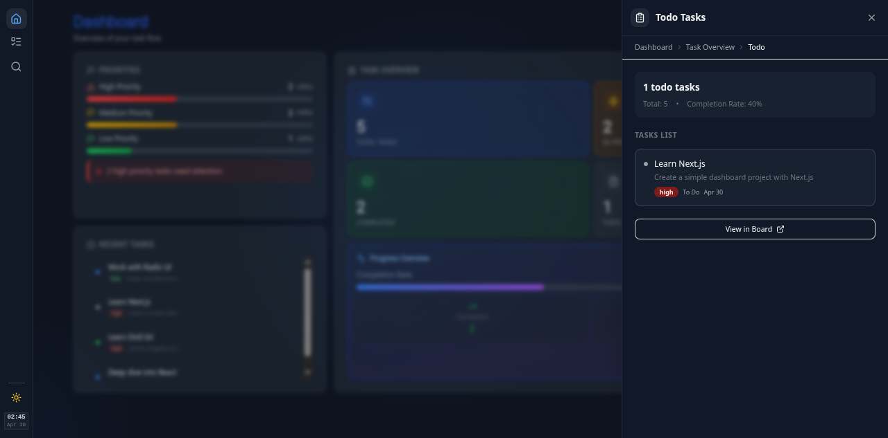
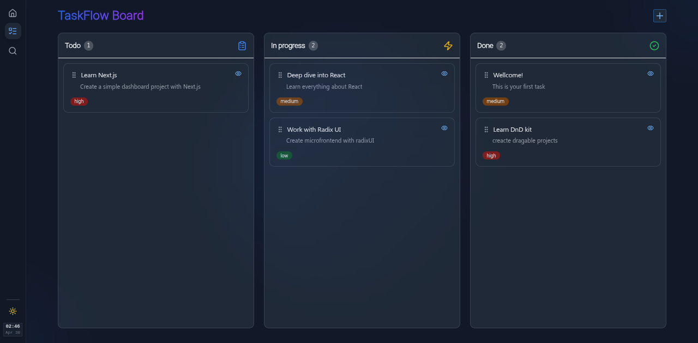
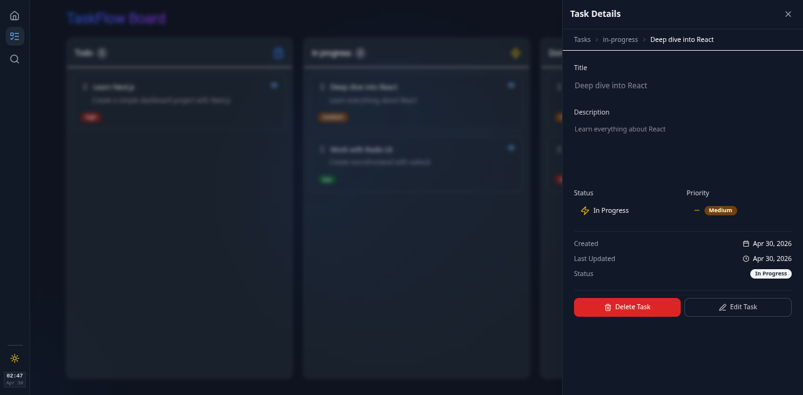
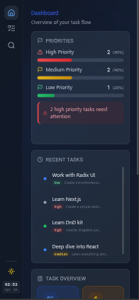
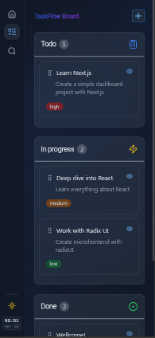
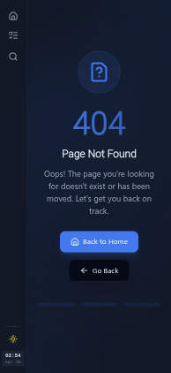
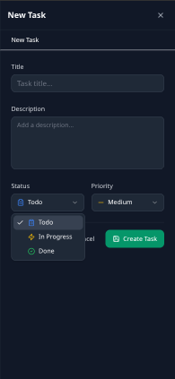
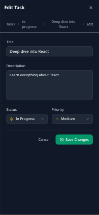

# 🚧 WIP (Work In Progress)

> **This project is currently under active development.**
> Features, documentation, and structure may change frequently.
> Feel free to explore, but expect breaking changes and incomplete parts.

---

# React Kanban Board

A modern, high-performance Kanban board built with React 18 and TypeScript. Features a custom client-side router, intuitive drag-and-drop, interactive dashboard with sidebar drill-downs, and a polished responsive UI.






| Mobile Dashboard | Mobile Tasks | Not Found Page |
|:---:|:---:|:---:|
|  |  |  |

| New Task | Edit Task |
|:---:|:---:|
|  |  |


## Features

- **Kanban Board:** Drag-and-drop tasks across "To Do", "In Progress", and "Done" columns
- **Interactive Dashboard:** Task overview widgets with drill-down sidebar for filtered views
- **Activity Heatmap:** 365-day GitHub-style contribution graph with canvas rendering engine and smart tooltips
- **Sidebar Orchestration Engine:** Centralized panel management with z-index stacking, overlay coordination, and priority-based minimize/restore
- **Quick Actions:** Floating action button for instant task creation
- **Live Search:** Command-palette-style search with keyboard shortcut (⌘K / Ctrl+K)
- **Dark/Light Mode:** Full theme support with system preference detection
- **Fully Responsive:** Optimized for desktop, tablet, and mobile
- **Priority System:** Visual badges for Low, Medium, and High priority tasks
- **Persistent Storage:** Tasks saved to localStorage automatically
- **Accessible:** Built with Radix UI primitives following WAI-ARIA standards

## Sidebar Orchestration Engine

The engine is an **event-driven layer** that centralizes floating panel lifecycle management. Instead of each panel managing its own overlay, z-index, and transitions independently, the engine acts as a **single source of truth**.

### Architecture

```
┌─────────────────────────────────────────┐
│              SidebarProvider            │
│  ┌───────────────────────────────────┐  │
│  │        PanelRenderer              │  │
│  │  ┌──────────┐  ┌──────────────┐   │  │
│  │  │ Overlay  │  │ Panel Stack  │   │  │
│  │  │ (ml-16)  │  │ (LIFO)       │   │  │
│  │  └──────────┘  └──────────────┘   │  │
│  └───────────────────────────────────┘  │
│                    │                    │
│         ┌──────────▼──────────┐         │
│         │  SidebarEngineStore │         │
│         │  (Zustand)          │         │
│         │  - panels           │         │
│         │  - stack            │         │
│         │  - register/open/   │         │
│         │    close/closeAll   │         │
│         └─────────────────────┘         │
└─────────────────────────────────────────┘
```

### Core Concepts

**Panel Registration:** Panels declare themselves via `useSidebarPanel` hook. The engine assigns base z-index and manages their lifecycle.

```typescript
useSidebarPanel({
  id: 'task-sidebar',
  component: TaskSidebar,     // Must implement PanelProps
  priority: 10,               // Higher = on top, minimizes lower panels
});
```

**Priority Stacking:** When a higher-priority panel opens, lower-priority panels auto-minimize. On close, minimized panels restore in order. Think iOS app switching, but for sidebars.

**Overlay Coordination:** A single overlay renders at `topPanelZIndex - 100`, always behind the active panel. It respects the main sidebar with `margin-left: 4rem`.

**LIFO Closing:** Panels close in Last-In-First-Out order via `closeTop()`. Clicking the overlay triggers this automatically.

**Route Awareness:** All panels auto-close on route change via `closeAll()` integrated into the custom router.

### Adding a New Panel

```typescript
// 1. Create component implementing PanelProps
const MyPanel: React.FC<PanelProps> = ({ isOpen, onClose }) => (
  <div className={`fixed right-0 transition-transform duration-300 
    ${isOpen ? 'translate-x-0' : 'translate-x-full'}`}>
    <button onClick={onClose}>Close</button>
  </div>
);

// 2. Register it
useSidebarPanel({
  id: 'my-panel',
  component: MyPanel,
  priority: 7,
});

// 3. Open from anywhere
useSidebarEngineStore.getState().open('my-panel', { metadata: 'here' });
```
## Activity Heatmap Engine

The heatmap engine is a **pure rendering layer** decoupled from React's lifecycle. It handles canvas drawing, pixel-precise mouse tracking, retina display scaling, theme-aware color mapping, and tooltip positioning—all through a clean separation between engine logic, Zustand state, and dumb UI components.

### Architecture

```
┌──────────────────────────────────────────────────┐
│                 ActivityHeatmap                  │
│  ┌────────────────────────────────────────────┐  │
│  │         HeatmapRenderer (Pure TS)          │  │
│  │  ┌──────────────┐  ┌──────────────────┐    │  │
│  │  │ Canvas Draw  │  │  Mouse Tracking  │    │  │
│  │  │ - Cells      │  │  - getCanvasPos  │    │  │
│  │  │ - Month/ Day │  │  - Cell hit test │    │  │
│  │  │   Labels     │  │  - Hover clear   │    │  │
│  │  └──────────────┘  └──────────────────┘    │  │
│  │  ┌──────────────┐  ┌──────────────────┐    │  │
│  │  │ Color Engine │  │  Tooltip Pos     │    │  │
│  │  │ - Theme map  │  │  - Viewport edge │    │  │
│  │  │ - Highlight  │  │    detection     │    │  │
│  │  │ - lightenCol │  │  - Arrow dir     │    │  │
│  │  └──────────────┘  └──────────────────┘    │  │
│  └────────────────────────────────────────────┘  │
│                       │                          │
│            ┌──────────▼──────────┐               │
│            │   HeatmapStore      │               │
│            │   (Zustand)         │               │
│            │   - heatmapData     │               │
│            │   - hoveredCell     │               │
│            │   - tooltipData     │               │
│            │   - highlightLevel  │               │
│            │   - calculateData() │               │
│            └─────────────────────┘               │
│                       │                          │
│     ┌─────────────────┼─────────────────┐        │
│     │                 │                 │        │
│  ┌──▼──┐   ┌──────────▼────┐   ┌────────▼───┐    │
│  │Stats│   │Canvas+Tooltip │   │  Legend    │    │
│  │Dumb │   │   Dumb        │   │  Dumb      │    │
│  └─────┘   └───────────────┘   └────────────┘    │
└──────────────────────────────────────────────────┘
```

### Core Concepts

**Data Flow:**
Tasks → calculateHeatmapData() → HeatmapStore → Dumb Components
↓
HeatmapRenderer
(reads days array,
renders canvas)

```text

Canvas mouse events flow back through the renderer's callback → store → Tooltip
component—React never touches the canvas internals.

```
**Framework-Agnostic Renderer:** `HeatmapRenderer` is a pure TypeScript class with zero React dependencies. It owns the `<canvas>` element, handles device pixel ratio scaling for retina displays, and draws 365 days of activity cells with rounded corners, subtle borders, and hover glow effects. All mouse event handling stays inside the renderer, reporting cell interactions through a single callback.

**Zustand State Bridge:** The store acts as the single source of truth between the engine and UI. `calculateData(tasks)` runs pure computations (date mapping, activity levels, streak counting) and stores the result. UI components subscribe to only the slices they need—`HeatmapStats` reads `totalActivity/activeDays/currentStreak`, `HeatmapLegend` reads `highlightLevel`, and `HeatmapTooltip` reads `tooltipData`.

**Smart Tooltip Positioning:** The tooltip calculator detects viewport boundaries and flips the tooltip above/below the cursor automatically. It also constrains horizontal position to prevent overflow, with the arrow always pointing at the hovered cell.

**Atomic Dumb Components:** Each visual piece is a focused component receiving only the props it renders. No component knows about data fetching, canvas internals, or state management—they're pure functions of their props.

**Performance Optimizations:**
- `React.memo` on all dumb components with shallow prop comparison
- `useMemo` for computed colors and legend items
- Renderer only redraws when options actually change via `setOptions()`
- Canvas event listeners use arrow functions to avoid rebinding

### Adding the Engine to Any View

```typescript
// 1. Calculate data when tasks change
const { heatmapData, calculateData } = useHeatmapStore();
useEffect(() => { calculateData(tasks); }, [tasks]);

// 2. Wire up cell hover to tooltip positioning
const handleCellHover = (date, count, clientX, clientY) => {
  if (date) {
    const pos = calculateTooltipPosition(clientX, clientY);
    setTooltipData({ date, count, ...pos });
  }
};

// 3. Compose with any layout
<HeatmapStats totalActivity={data.totalActivity} ... />
<HeatmapCanvas onCellHover={handleCellHover} />
<HeatmapTooltip />
<HeatmapLegend highlightLevel={level} onHover={setLevel} />
```

### Why Separate the Engine?

| Concern | Without Engine | With Engine |
|---------|---------------|-------------|
| **Canvas logic** | Mixed in React component (200+ lines) | Isolated `HeatmapRenderer` class |
| **Testing** | Requires full React render | Pure functions, no DOM needed |
| **Reusability** | Tied to one component | Drop into any view with any layout |
| **Debugging** | Hard to isolate canvas vs state bugs | Clear boundaries: engine → store → UI |
| **Performance** | Re-renders trigger redraws | Explicit `setOptions()` control |

## Tech Stack


## Project Structure

```
src/
├── assets/                    # Static assets
├── components/
│   ├── board/                 # Kanban board, columns, task cards
│   │   ├── TaskSidebar/       # Task detail/edit/create sidebar panel
│   │   └── __test__/          # Board component tests
│   ├── dashboard/             # Dashboard with interactive widgets
│   │   ├── DashboardSidebar/  # Drill-down sidebar panel (engine-managed)
│   │   └── widgets/           # Task stats, recent tasks, priority breakdown
│   │       ├──
│   │       └── activity-heatmap/ # Heatmap feature module
│   │       ├── engine/ # Pure calculations & canvas renderer class
│   │       ├── store/ # Zustand state bridge
│   │       ├── components/ # Dumb UI: Stats, Canvas, Tooltip, Legend
│   │       └── types.ts # Shared TypeScript types & constants
│   ├── layout/                # Main layout, sidebar navigation, search
│   └── ui/                    # Reusable UI primitives (Button, Badge, etc.)
├── hooks/                     # Custom React hooks (useSidebarPanel)
├── lib/                       # Utility functions (cn helper)
├── providers/                 # SidebarProvider, ThemeProvider, AppProvider
├── router/                    # Custom client-side router
│   └── Pages/                 # Route page components
├── stores/                    # Zustand state management
│   ├── sidebar-engine/        # 🚀 Engine core (types, store)
│   ├── task.store.ts          # Task CRUD operations
│   ├── task-sidebar.store.ts  # Task panel state machine
│   └── dashboard-sidebar.store.ts # Dashboard panel state
└── test/                      # Test setup and configuration
```

## Getting Started

### Prerequisites

- **Node.js** v18 or later
- **pnpm** (recommended) or npm

### Installation

```bash
# Clone the repository
git clone https://github.com/Mehrdadnka/react-kanban.git
cd react-kanban

# Install dependencies
pnpm install

# Start development server
pnpm dev
```

Open [http://localhost:5173](http://localhost:5173) in your browser.

### Production Build

```bash
pnpm build
```

Output will be in the `dist/` directory.

## Testing

This project uses **Vitest** with **React Testing Library** for comprehensive component and store testing.

### Quick Commands

```bash
pnpm test          # Watch mode
pnpm test:run      # Run once
pnpm test:coverage # With coverage report
pnpm test:ui       # Vitest UI dashboard
```

### Testing Philosophy

- **Behavior over implementation:** Tests assert user-facing behavior, not internal state
- **Isolation:** Components tested independently with mocked dependencies
- **Realistic scenarios:** Test cases mirror actual user workflows

## Key Learnings

This project was a deep dive into React internals and modern front-end architecture:

- **Sidebar Orchestration Engine:** Designed an event-driven panel management system with z-index stacking, priority-based minimize/restore, LIFO closing, and route-aware cleanup. Replaced Framer Motion with optimized CSS transitions for a 40%+ performance improvement.
- **Canvas Engine Architecture:** Separated a pure TypeScript renderer from React's lifecycle, handling retina scaling, pixel-precise mouse hit testing, and theme-aware color mapping. Bridged to React via Zustand for minimal re-renders
- **Custom Router:** Built `pushState`, `popState`, and navigation from scratch to understand client-side routing
- **Drag & Drop:** Implemented complex DnD with `@dnd-kit`, including drag overlays and cross-column movement
- **State Management:** Designed Zustand stores with clean separation of concerns—engine state vs panel-specific state vs domain state
- **Component Architecture:** Applied provider pattern, compound components, and separation of concerns
- **Performance Optimization:** Replaced Framer Motion with CSS transitions, added React.memo, shallow comparison selectors, and DOM removal for hidden panels
- **UI Primitives:** Leveraged Radix UI for accessible, unstyled components with Tailwind customization
- **Type Safety:** Achieved strict TypeScript with Record types, discriminated unions, and type narrowing
- **Testing Infrastructure:** Configured Vitest with jsdom, mock strategies, and reusable test utilities

## Contributing

This is a personal showcase project. If you have ideas for improvements or discover a bug, feel free to open an issue or submit a pull request.

## Contact

- **GitHub:** [@Mehrdadnka](https://github.com/Mehrdadnka)
- **Email:** mehrdad2762@gmail.com
