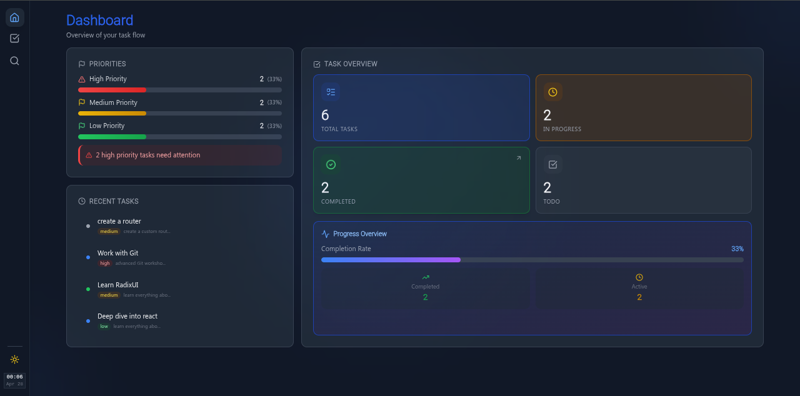
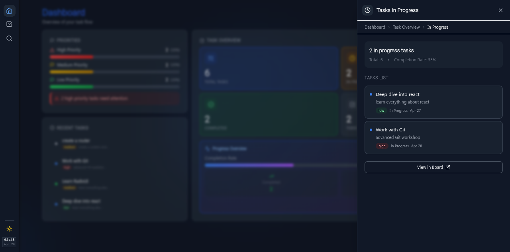
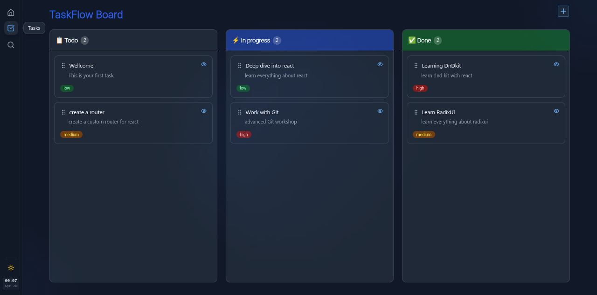
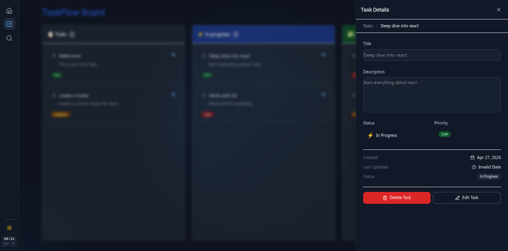
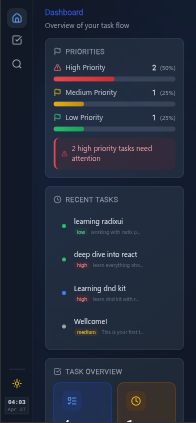
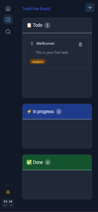
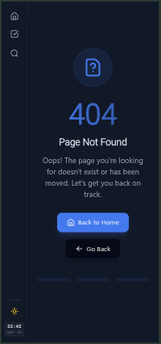
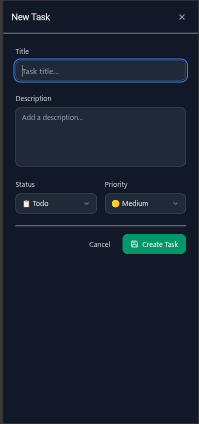
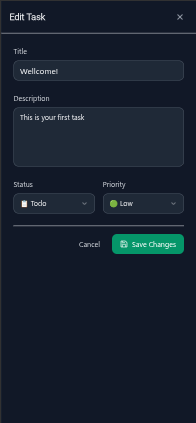
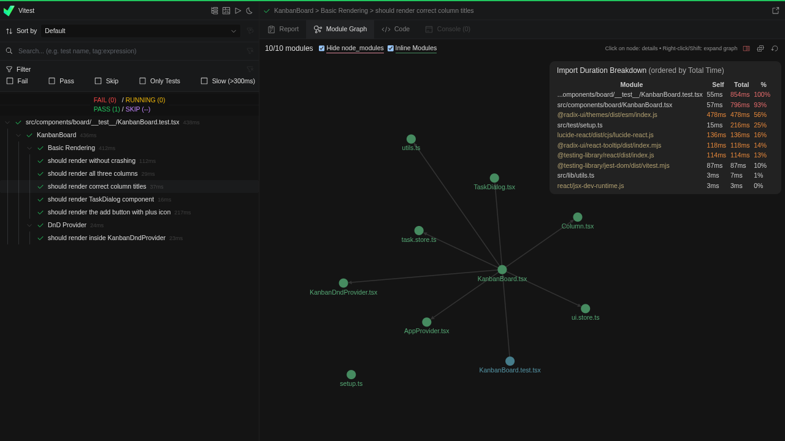

# React Kanban Board

A modern, high-performance Kanban board built with React 18 and TypeScript. Features a custom client-side router, intuitive drag-and-drop, interactive dashboard with sidebar drill-downs, and a polished responsive UI.






| Mobile Dashboard | Mobile Tasks | Not Found Page |
|:---:|:---:|:---:|
|  |  |  |

| New Task | Edit Task |
|:---:|:---:|
|  |  |



## Features

- **Kanban Board:** Drag-and-drop tasks across "To Do", "In Progress", and "Done" columns
- **Interactive Dashboard:** Task overview widgets with drill-down sidebar for filtered views
- **Quick Actions:** Floating action button for instant task creation
- **Live Search:** Command-palette-style search with keyboard shortcut (⌘K / Ctrl+K)
- **Dark/Light Mode:** Full theme support with system preference detection
- **Fully Responsive:** Optimized for desktop, tablet, and mobile
- **Priority System:** Visual badges for Low, Medium, and High priority tasks
- **Persistent Storage:** Tasks saved to localStorage automatically
- **Accessible:** Built with Radix UI primitives following WAI-ARIA standards (Web Accessibility Initiative - Accessible Rich Internet Applications)

## Tech Stack


## Project Structure

```
src/
├── assets/                    # Static assets
├── components/
│   ├── board/                 # Kanban board, columns, task cards
│   │   ├── TaskSidebar/       # Task detail/edit/create sidebar
│   │   └── __test__/          # Board component tests
│   ├── dashboard/             # Dashboard with interactive widgets
│   │   ├── DashboardSidebar/  # Drill-down sidebar for widgets
│   │   └── widgets/           # Task stats, recent tasks, priority breakdown
│   ├── layout/                # Main layout, sidebar navigation, search
│   └── ui/                    # Reusable UI primitives (Button, Badge, etc.)
├── hooks/                     # Custom React hooks
├── lib/                       # Utility functions (cn helper)
├── providers/                 # App-wide providers (theme, context)
├── router/                    # Custom client-side router
│   └── Pages/                 # Route page components
├── stores/                    # Zustand state management stores
└── test/                      # Test setup and configuration
```

## Getting Started

### Prerequisites

- **Node.js** v18 or later
- **pnpm** (recommended) or npm

### Installation

```bash
# Clone the repository
git clone https://github.com/Mehrdadnka/react-kanban.git
cd react-kanban

# Install dependencies
pnpm install

# Start development server
pnpm dev
```

Open [http://localhost:5173](http://localhost:5173) in your browser.

### Production Build

```bash
pnpm build
```

Output will be in the `dist/` directory.

## Testing

This project uses **Vitest** with **React Testing Library** for comprehensive component and store testing.

### Quick Commands

```bash
pnpm test          # Watch mode
pnpm test:run      # Run once
pnpm test:coverage # With coverage report
pnpm test:ui       # Vitest UI dashboard
```

### Testing Philosophy

- **Behavior over implementation:** Tests assert user-facing behavior, not internal state
- **Isolation:** Components tested independently with mocked dependencies
- **Realistic scenarios:** Test cases mirror actual user workflows

### Current Coverage

-  Component rendering and mounting
-  Zustand store mocking patterns
-  DOM assertions and query strategies
-  User interaction flows (drag-and-drop, forms)
-  Store state transitions
-  Router navigation behavior

## Key Learnings

This project was a deep dive into React internals and modern front-end architecture:

- **Custom Router:** Built `pushState`, `popState`, and navigation from scratch to understand client-side routing
- **Drag & Drop:** Implemented complex DnD with `@dnd-kit`, including drag overlays and cross-column movement
- **State Management:** Designed Zustand stores with persistence middleware and clean separation of concerns
- **Component Architecture:** Applied provider pattern, compound components, and separation of concerns
- **UI Primitives:** Leveraged Radix UI for accessible, unstyled components with Tailwind customization
- **Type Safety:** Achieved strict TypeScript with Record types, discriminated unions, and type narrowing
- **Testing Infrastructure:** Configured Vitest with jsdom, mock strategies, and reusable test utilities

## Contributing

This is a personal showcase project. If you have ideas for improvements or discover a bug, feel free to open an issue or submit a pull request.

## Contact

- **GitHub:** [@Mehrdadnka](https://github.com/Mehrdadnka)
- **Email:** mehrdad2762@gmail.com

---

Built with React, TypeScript, and modern web technologies.
